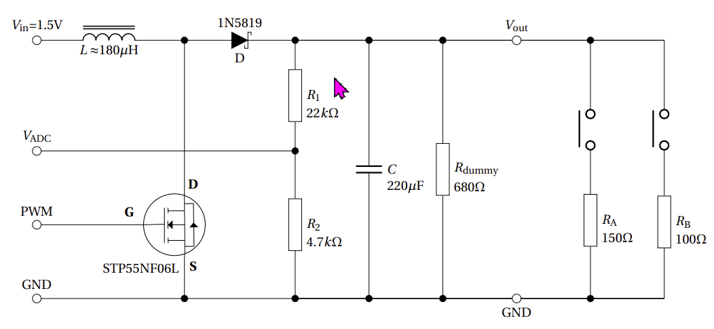

# Boost_Converter_With_PID



<div id="top"></div>

<!-- ABOUT THE PROJECT -->
## About The Project

This code allows a microcontroller to adjust a PWM wave to generate the correct output of a boost converter via a PID controller  

<p align="right">(<a href="#top">back to top</a>)</p>

<!-- GETTING STARTED -->
## Getting Started

### Prerequisites

You will need [make](https://www.mingw-w64.org/downloads/#mingw-builds) for this.

### Installation

1. Clone the repo
   ```
   git clone https://github.com/chriswebbb/MIPS_Emulator
   ```

2.  Go into the directory.

3.  Then run make and it should generate an .o file, with the same name.

4.  Then to upload to the AVR microcontroller.
    ```
    avr-gcc -u vfprintf -lprintf_flt -lm -mmcu=atmega644p -DF_CPU=12000000 -Wall -Os embedded_boost.c -o boost.elf
    ```
    ```
    avr-objcopy -O ihex boost.elf boost.hex
    ```
    ```
    avrdude -c usbasp -p m644p -U flash:w:boost.hex
    ```

4.  Now it work.

<p align="right">(<a href="#top">back to top</a>)</p>

<!-- LICENSE -->
## License

Distributed under the MIT License.

<p align="right">(<a href="#top">back to top</a>)</p>
